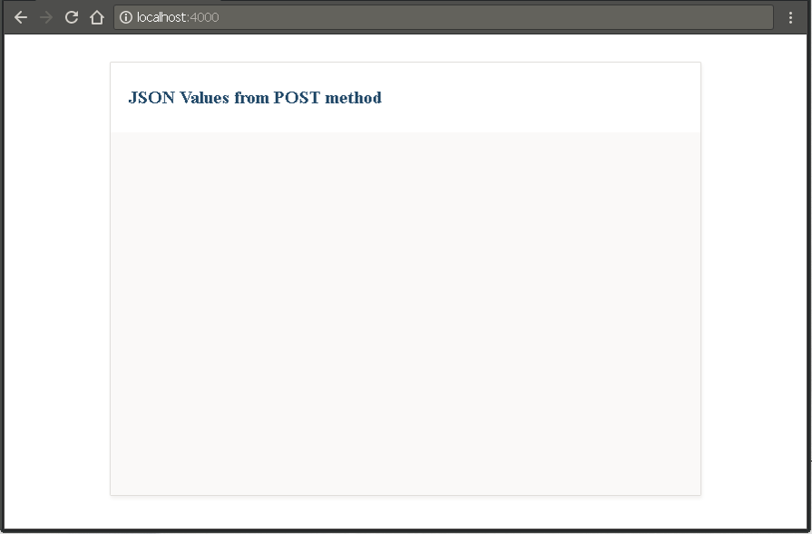
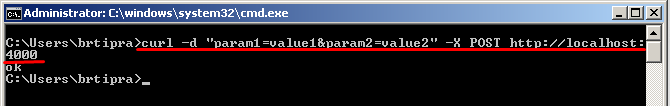
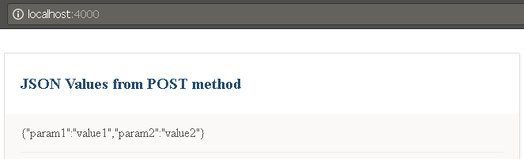

# Real time JSON browser
This project uses websockets to display in the browser the JSON data sent via POST method in real time.

## How to
* Execute `node index.js`
* Open browser in `http://localhost:4000/`

* Send POST containing JSON data (E.g. `curl -d "param1=value1&param2=value2" -X POST http://localhost:4000`)

* **Output**

